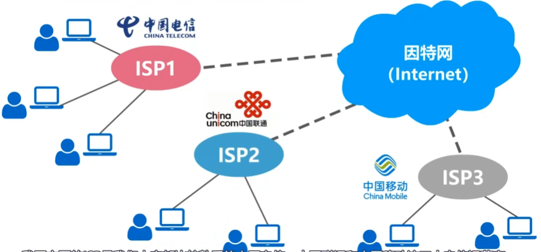
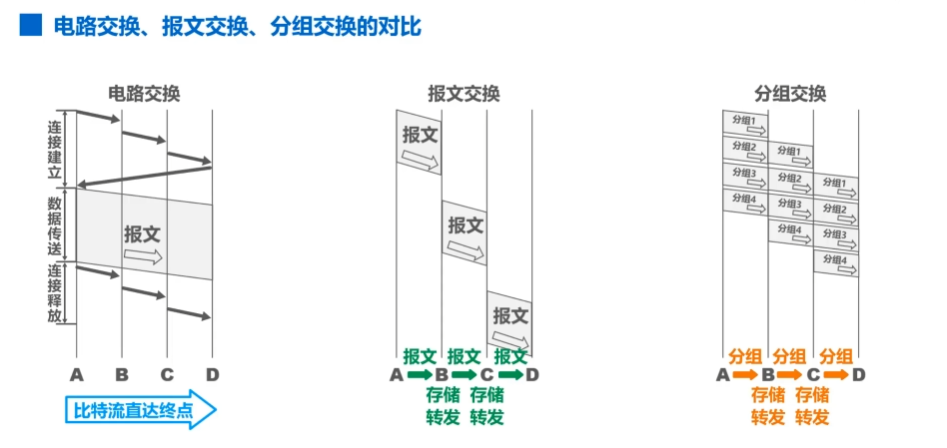
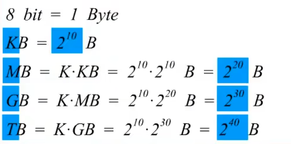
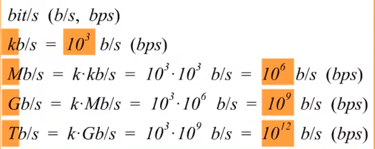
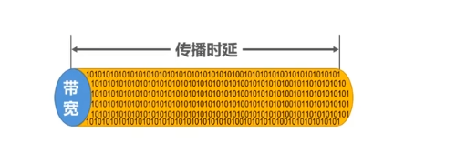
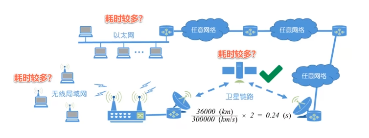
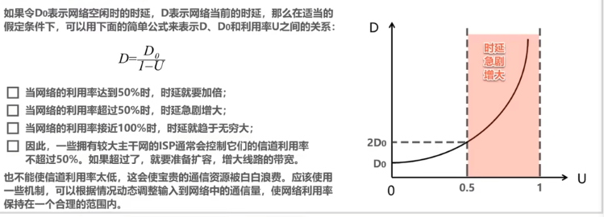

# 计网

## 概述
因特网服务提供者**ISP**

### 因特网的组成
1. 边缘部分
    由所有连接在因特网上的主机组成，这部分是用户直接使用和资源共享
2. 核心部分
    由大量网络和连接这些网络的路由器组成，这部分是为边缘部分提供服务的
###  三种交换方式
**电路交换**
1. 电话交换机接通电话线的方式
2. 电路交换的三个步骤
   1. 建立连接 (分配通信资源)
   2. 通话(一直占用资源)
   3. 释放连接(归还通信资源)
3. 当使用电路交换来传送计算机数据时，线路的传输效率往往很低
     

**分组交换**
发送方:构造分组发送分组
路由器:缓存分组转发分组
接收方:接受分组还原报文
**报文交换**  
与分组类似，主要用于早期的电报通信网，现在较少使用  

*三者对比*
  
**三者优缺点**
*电路交换*:
1. 优点
   1. 通信时延小
   2. 有序传输
   3. 没有冲突
   4. 适用范围广
   5. 实时性强
   6. 控制简单
2. 缺点
   1. 建立连接时间长
   2. 线路独占，使用效率低
   3. 灵活性差
   4. 难以规格化  
   
*报文交换*:
1. 优点
   1. 无需建立连接
   2. 动态分配线路
   3. 提高线路可靠性
   4. 提高线路利用率
   5. 提供多目标服务
2. 缺点
   1. 引起转发时延
   2. 需要较大存储缓存空间
   3. 需要传输额外的信息量  
   
*分组交换*:
1. 优点
   1. 无需建立连接
   2. 线路利用率高
   3. 简化了储存管理
   4. 加速传输
   5. 减少出错概率和重发数据量
2. 缺点
   1. 引起转发时延
   2. 需要传输额外的信息量
   3. 对于数据服务，存在失序，丢失或重复分组的问题，对于虚电路服务，存在呼叫建立，数据传输和虚电路释放三个过程

### 计算机网络分类
##### 按交换技术分类
1. 电路交换网络
2. 报文交换网络
3. 分组交换网络
##### 按使用者分
1. 公用网
2. 专用网
##### 按传输介质分类
1. 有线网络
2. 无线网络
##### 按覆盖范围分类
1. 广域网 WAN
2. 域域网 WAN
3. 局域网 LAN
4. 个域网 PAN
##### 按拓扑结构分类
1. 总线型网络
2. 星形网络
3. 环形网络
4. 网状型网络

### 计算机网络的性能指标
#### 速率
速率:是指在计算机网络上的主机在数字信道上传送比特的速率，也称为比特率或数据率
比特:计算机中数据量的单位
*常用数据量单位*
  
*常用数据率单位*

#### 带宽
带宽:(在计算机网络中的意义)用来表示网络的通信线路所能传送数据的能力。  
一条通信线路的频带宽度越宽，其所传输的最高数据率也越高
*单位:b/s(kb/s,Mb/s,Gb/s,Tb/s)*
#### 吞吐量
吞吐量：表示单位时间内通过某个网络的数据量  
吞吐量受网络带宽或额定速率的限制
#### 时延
1. 发送时延 
   $$\frac{分组长度(b)}{发送速率(b/s)}$$
2. 传播时延
     $$\frac{信道长度(m)}{电磁波传播速率(m/s)}$$*电磁波传播速率:1.自由空间 3x10^8m/s 2.铜线 2.3x10^8m/s 3.光纤 2.0x10^8m/s*
3. 处理时延
   一般不方便计算
#### 时延带宽积
时延带宽积=传播时延X带宽

#### 往返时间 RTT

#### 利用率
$$利用率=\left\{\begin{array}{l}
信道利用率:表示某信道有百分之几的时间是利用的\\ 网络利用率:全网络的信道利用率的加权平均
\end{array}\right.$$

#### 丢包率
丢包率是指在一定时间范围内，传输过程中丢失的分组数量与总分组数量的比率
分组丢失主要有两种情况
    1. 分组在传输过程中出现误码被结点丢弃
    2. 分组到达一台队列已满的分组交换机时被丢弃；在通信量较大时就可能造成网络拥塞
丢包率也反应了网络的拥塞情况
1. 无拥塞时路径丢包率为0
2. 轻度拥塞时路径丢包率为1%-4%
3. 严重拥塞时路劲丢包率为5%-15%
